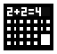

# 
La calcolatrice più incredibile al mondo (quasi)!

Sigma è un'applicazione che fornisce dei piccoli servizi legati alle operazioni matematiche!

Fra queste, c'è anche la calcolatrice.

Tutto è programmato in python e il software può essere usato sotto la licensa MIT (leggi il file LICENSE)!

# Info per programmatori
Il file ".sgms" è un'estensione per indicare che il contenuto viene utilizzato dall'applicazione per scopi specifici.

# Funzioni:
I servizi offerti sono:
## Calcolatrice
### 
La calcolatrice di Sigma è scritta in python ed è strutturata in modo speciale: usa `eval()` per tutto!
## Convertitore
### 
Il convetitore può essere utile per le equivalenze fra unità di misura.
Le grandezze disponibili sono:
- Lunghezza
- Massa
- Valuta

Ancora sono disponibili solo queste, ma potrebbero essercene altre in futuro...
## Tavola di numeri primi
### 
Una tavola che genera numeri primi, precisamente 500 alla volta, che può servire per la qualunque evenienza.

Lo so, è essenziale!
## Memo
### 
Se ti sfugge qualcosa, hai bisogno di scrivere il calcolo, elaborarlo o scrivere qualche nota che potrebbe servire... il memo sarà il tuo strumento prediletto!

Il blocco note è strutturato in maniera semplice, essenziale, fondamentale... ma anche in modo completo!

# Altro...
Questo strumento è stato realizzato da un ragazzino di 12 anni, dunque non potrà essere un software rivoluzionario...

O almeno credo... :)

Non mi interessano le donazioni, ma una stella è più che gradita... 
Grazie! ^_^

Software sviluppato con molta fortuna in Italia da...
## ")

