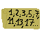

# 
The most incredible calculator in the world (almost)!

Sigma is an application that provides small services related to mathematical operations!

Among these is also the calculator.

Everything is programmed in Python, and the software can be used under the MIT license (read the LICENSE file)!

# Info for Developers
The ".sgms" file extension indicates that the content is used by the application for specific purposes.

# Features:
The services offered are:
## Calculator
### 
Sigma's calculator is written in Python and is specially designed: it uses `eval()` for everything!
## Converter
### 
The converter can be useful for equivalences between units of measurement.
The available quantities are:
- Length
- Mass
- Currency

For now, only these are available, but more may be added in the future...
## Prime Numbers Table
### 
A table that generates prime numbers, precisely 500 at a time, which can be useful for any occasion.

I know, it's essential!
## Memo
### 
If you forget something, need to write down a calculation, elaborate on it, or jot down some notes that might be useful... the memo will be your go-to tool!

The notebook is designed simply, essentially, fundamentally... but also comprehensively!

# Other...
This tool was created by a 12-year-old kid, so it might not be revolutionary software...

Or so I think... :)

I'm not interested in donations, but a star is more than welcome...
Thank you! ^_^

Software developed with much luck in Italy by...
## ")